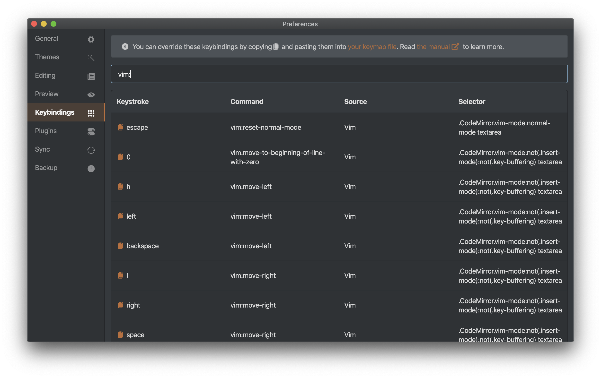

# vim keybindings plugin for Inkdrop

Provides Vim modal control for Inkdrop, blending the best of Vim and Inkdrop.

## Features

 * All common motions and operators, including text objects
 * Operator motion orthogonality
 * Visual mode - characterwise, linewise, blockwise
 * Incremental highlighted search (`/`, `?`, `#`, `*`, `g#`, `g*`)
 * Search/replace with confirm (:substitute, :%s)
 * Search history
 * Sort (`:sort`)
 * Marks (`,`)
 * `:global`
 * Cross-buffer yank/paste

## Install

```sh
ipm install vim
```

## Key customizations

Default vim keymaps are defined [here](./keymaps/vim.json) and you can override them in your `keymap.cson` file.

CSS selectors for each mode:

 * Not insert mode: `.CodeMirror.vim-mode:not(.insert-mode):not(.key-buffering) textarea`
 * Normal mode: `.CodeMirror.vim-mode.normal-mode:not(.key-buffering) textarea`
 * Insert mode: `.CodeMirror.vim-mode.insert-mode textarea`
 * Replace mode: `.CodeMirror.vim-mode.replace-mode textarea`
 * Visual mode: `.CodeMirror.vim-mode.visual-mode:not(.key-buffering) textarea`

You can check current keybindings on the *Keybindings* pane on preferences window:



## Ex Commands

### `:w`, `:write`

Saves current note immediately to the disk.

### `:next`, `:n`

Opens next note on the note list.

### `:prev`

Opens previous note on the note list.

### `:preview`, `:p`

Toggles HMTL preview.

### `:side-by-side`, `:side`

Toggles side-by-side mode.

